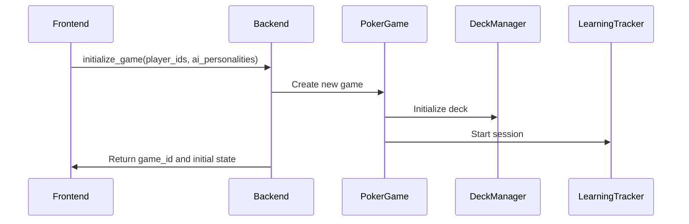
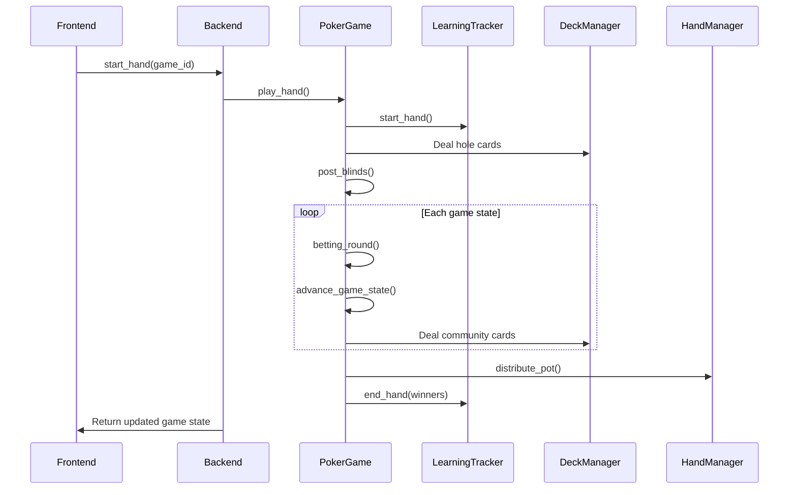
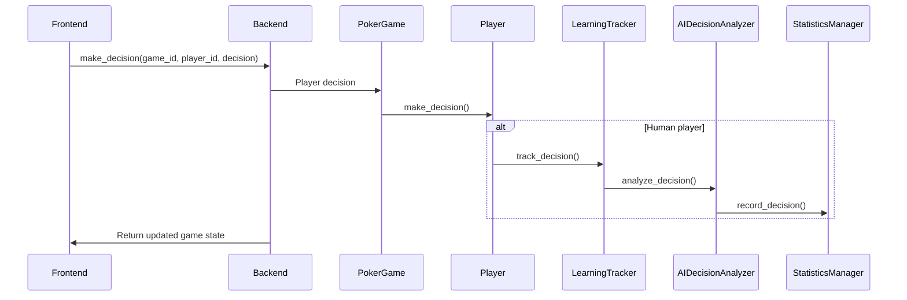
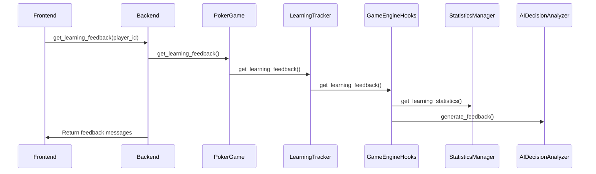

# Poker Learning App Backend Documentation

This document provides a comprehensive overview of the Poker Learning App backend system, focusing on the information needed for API development and frontend integration.

## Table of Contents

1. [System Overview](#system-overview)
2. [Core Components](#core-components)
3. [Data Structures](#data-structures)
4. [API Interface Points](#api-interface-points)
5. [Game Flow](#game-flow)
6. [AI System](#ai-system)
7. [Learning & Statistics System](#learning--statistics-system)
8. [Dependencies](#dependencies)
9. [Error Handling](#error-handling)

## System Overview

The Poker Learning App backend is a comprehensive Texas Hold'em poker game system with AI players and learning capabilities. The system allows human players to play against various AI personalities, tracks game statistics, analyzes player decisions, and provides learning feedback.

### Technology Stack

- **Language**: Python
- **Key Libraries**: Treys (poker hand evaluation), Logger (custom logging)
- **Architecture**: Modular component-based design with clear separation of concerns
- **Deployment**: Docker containerization support

## Core Components

### Game Engine (Primary Interface Point)

The game engine (`game/poker_game.py`) is the central component that coordinates the entire poker game.

```python
class PokerGame:
    # Core attributes
    players: List[Player]           # All players in the game
    deck: List[str]                 # Current deck of cards  
    community_cards: List[str]      # Shared community cards
    pot: int                        # Current pot size
    current_bet: int                # Current bet amount
    small_blind: int                # Small blind amount
    big_blind: int                  # Big blind amount
    dealer_index: int               # Current dealer position
    current_state: GameState        # Current game state
    hand_count: int                 # Number of hands played
    
    # Key methods
    def __init__(self, players: List[Player])
    def reset_deck() -> None
    def deal_hole_cards() -> None
    def deal_community_cards() -> None
    def post_blinds() -> None
    def betting_round() -> None
    def advance_game_state() -> None
    def play_hand() -> None
    def distribute_pot(deck=None) -> None
    def end_session() -> None
    def get_learning_feedback(player_id: str, num_decisions: int = 1) -> List[str]
    def get_strategy_profile(player_id: str) -> Dict[str, Any]
```

### Deck Manager

Manages the deck of cards, dealing, and tracking card state.

```python
class DeckManager:
    # Key methods
    def reset() -> None
    def get_deck() -> List[str]
    def deal_hole_cards(num_players: int) -> List[List[str]]
    def deal_to_player(num_cards: int = 2) -> List[str]
    def deal_flop() -> List[str]
    def deal_turn() -> str
    def deal_river() -> str
    def get_community_cards() -> List[str]
    def get_stats() -> Tuple[int, int, int, int]
```

### Hand Manager

Evaluates poker hands and distributes pots.

```python
class HandManager:
    # Key methods
    def evaluate_hands(players, community_cards: List[str], deck: List[str]) -> Dict[str, Tuple[int, str, Any]]
    def distribute_pot(players, community_cards: List[str], total_pot: int, deck: List[str]) -> Dict[str, int]
```

### Poker Round

Manages a single round of betting.

```python
class PokerRound:
    # Key methods
    def __init__(self, players, dealer_index: int, current_state: GameState, pot: int, current_bet: int, big_blind: int, hand_id: str = None)
    def execute_betting_round() -> int
```

### Player Models

Different types of players in the system.

```python
class Player:
    player_id: str
    stack: int
    hole_cards: List[str]
    is_active: bool
    current_bet: int
    all_in: bool
    total_bet: int
    
    # Key methods
    def bet(amount: int) -> int
    def receive_cards(cards: List[str]) -> None
    def eliminate() -> None
    def reset_round_state() -> None
    def reset_hand_state() -> None
    def make_decision(game_state: Dict[str, Any], deck: List[str], spr: float, pot_size: int) -> str

class AIPlayer(Player):
    personality: str
    
    # Overrides make_decision to use AI strategy

class HumanPlayer(Player):
    # Extends make_decision to track decisions for learning
```

### Learning Tracker

Tracks and analyzes learning-related statistics.

```python
class LearningTracker:
    # Key methods
    def start_session() -> Optional[str]
    def end_session() -> None
    def start_hand() -> Optional[str]
    def end_hand(winners: Dict[str, int]) -> None
    def track_decision(player_id: str, decision: str, hole_cards: List[str], game_state: Dict[str, Any], deck: List[str], pot_size: int, spr: float) -> None
    def get_learning_feedback(player_id: str, num_decisions: int = 1) -> List[str]
    def get_strategy_profile(player_id: str) -> Dict[str, Any]
```

## Data Structures

### Game State Enum

```python
class GameState(Enum):
    PRE_FLOP = "pre_flop"
    FLOP = "flop"
    TURN = "turn"
    RIVER = "river"
    SHOWDOWN = "showdown"
```

### Card Representation

Cards are represented as strings in the format `"rank+suit"`:
- Ranks: 2-9, T (10), J, Q, K, A
- Suits: s (spades), h (hearts), d (diamonds), c (clubs)
- Examples: "Ah" (Ace of hearts), "Ts" (Ten of spades)

### Game State Dictionary

```python
game_state = {
    "hand_id": str,                # Unique identifier for the current hand
    "community_cards": List[str],  # Shared community cards
    "current_bet": int,            # Current bet amount to call
    "pot_size": int,               # Total pot size
    "game_state": str              # Current game state (pre_flop, flop, etc.)
}
```

### Decision Data Dictionary

```python
decision_data = {
    "decision": str,                      # Player's decision (fold, call, raise)
    "matching_strategy": str,             # Strategy matching the player's decision
    "optimal_strategy": str,              # Optimal strategy for the situation
    "was_optimal": bool,                  # Whether the decision was optimal
    "strategy_decisions": Dict[str, str], # Decisions by different strategies
    "expected_value": float,              # Expected value of the decision
    "spr": float,                         # Stack-to-pot ratio
    "game_state": str,                    # Current game state
    "hole_cards": List[str],              # Player's hole cards
    "community_cards": List[str],         # Community cards
    "pot_size": int,                      # Current pot size
    "current_bet": int,                   # Current bet to call
    "timestamp": float,                   # When the decision was made
    "session_id": str                     # Session identifier
}
```

### Player Strategy Profile

```python
strategy_profile = {
    "strategy_distribution": Dict[str, float],     # Distribution of decisions by strategy
    "dominant_strategy": str,                      # Player's most frequent strategy
    "recommended_strategy": str,                   # Recommended strategy for improvement
    "decision_accuracy": float,                    # Percentage of optimal decisions
    "ev_ratio": float,                             # Percentage of positive EV decisions
    "total_decisions": int,                        # Total decisions analyzed
    "improvement_areas": List[Dict[str, Any]],     # Areas for improvement
    "learning_recommendations": List[Dict[str, Any]], # Recommendations for improvement
    "decision_trend": Dict[str, Any]               # Trend in decision quality
}
```

### Pot Information

```python
pot_info = {
    "amount": int,                      # Amount in the pot
    "eligible_players": Set[str]        # Players eligible to win this pot
}
```

## API Interface Points

### Game Management

```python
# Initialize a new game
def initialize_game(player_ids: List[str], ai_personalities: List[str]) -> Dict[str, Any]

# Start a new hand
def start_hand(game_id: str) -> Dict[str, Any]

# Get current game state
def get_game_state(game_id: str) -> Dict[str, Any]

# Make a player decision
def make_decision(game_id: str, player_id: str, decision: str) -> Dict[str, Any]

# End a game session
def end_game(game_id: str) -> Dict[str, Any]
```

### Player Management

```python
# Create a new player
def create_player(name: str) -> Dict[str, Any]

# Get player information
def get_player(player_id: str) -> Dict[str, Any]

# Update player information
def update_player(player_id: str, data: Dict[str, Any]) -> Dict[str, Any]
```

### Learning & Statistics

```python
# Get learning feedback for a player
def get_learning_feedback(player_id: str, num_decisions: int = 1) -> List[str]

# Get player strategy profile
def get_strategy_profile(player_id: str) -> Dict[str, Any]

# Get player statistics
def get_player_statistics(player_id: str) -> Dict[str, Any]

# Get session statistics
def get_session_statistics(session_id: str) -> Dict[str, Any]
```

## Game Flow

### 1. Game Initialization



### 2. Playing a Hand



### 3. Player Decision



### 4. Learning Feedback



## AI System

### AI Manager

The AI manager coordinates decisions across different AI personalities.

```python
class AIDecisionMaker:
    # Maps personality types to strategy implementations
    STRATEGY_MAP: Dict[str, Type[AIStrategyProtocol]] = {
        "Conservative": ConservativeStrategy,
        "Risk Taker": RiskTakerStrategy,
        "Probability-Based": ProbabilityBasedStrategy,
        "Bluffer": BlufferStrategy,
    }
    
    @staticmethod
    def make_decision(personality: str, hole_cards: List[str], 
                     game_state: Dict[str, Any], deck: List[str], 
                     pot_size: int, spr: float) -> str
```

### AI Strategy Protocol

All AI strategies implement this common interface.

```python
class AIStrategyProtocol(Protocol):
    def evaluate_hand(self, hole_cards: List[str], community_cards: List[str], 
                     deck: List[str]) -> Tuple[float, str]
    
    def make_decision(self, hole_cards: List[str], game_state: Dict[str, Any], 
                     deck: List[str], pot_size: int, spr: float) -> str
```

### Hand Evaluator

Provides hand strength evaluation for AI decisions.

```python
class HandEvaluator:
    def evaluate_hand(self, hole_cards: List[str], community_cards: List[str], 
                     deck: List[str]) -> Tuple[float, str]
```

### Available AI Personalities

1. **Conservative Strategy**:
   - Plays tight and only commits with strong hands
   - Avoids risky situations
   - Focuses on value betting

2. **Risk Taker Strategy**:
   - Plays aggressively
   - Willing to bluff and take chances
   - Puts pressure on opponents

3. **Probability-Based Strategy**:
   - Makes decisions based on mathematical calculations
   - Considers pot odds and expected value
   - Balanced approach to betting

4. **Bluffer Strategy**:
   - Unpredictable betting patterns
   - Frequently bluffs with weak hands
   - Attempts to confuse opponents

## Learning & Statistics System

### Statistics Manager

Central component for tracking and analyzing game statistics.

```python
class StatisticsManager:
    # Key methods
    def start_session(session_id: Optional[str] = None) -> str
    def end_session(session_id: str) -> None
    def get_player_statistics(player_id: str) -> Optional[PlayerStatistics]
    def get_session_statistics(session_id: str) -> Optional[SessionStatistics]
    def get_learning_statistics(player_id: str) -> LearningStatistics
    def record_decision(player_id: str, decision_data: Dict[str, Any]) -> None
```

### Decision Analyzer

Analyzes player decisions by comparing with AI strategies.

```python
class AIDecisionAnalyzer:
    # Key methods
    def analyze_decision(player_id: str, player_decision: str, hole_cards: List[str], 
                       game_state: Dict[str, Any], deck: List[str], 
                       pot_size: float, spr: float) -> Dict[str, Any]
    
    def generate_feedback(decision_data: Dict[str, Any]) -> str
    
    def get_player_strategy_profile(player_id: str) -> Dict[str, Any]
```

### Learning Statistics

Tracks a player's decision quality and learning progress.

```python
class LearningStatistics:
    # Core attributes
    player_id: str
    total_decisions: int
    correct_decisions: int
    decisions_by_strategy: Dict[str, int]
    optimal_strategies: Dict[str, int]
    decision_history: List[Dict[str, Any]]
    positive_ev_decisions: int
    negative_ev_decisions: int
    
    # Key methods
    def add_decision(decision_data: Dict[str, Any]) -> None
    def get_recent_decisions(num_decisions: int = 10) -> List[Dict[str, Any]]
    def get_strategy_distribution() -> Dict[str, float]
```

### Analyzer Components

The system includes specialized analysis components:

1. **Feedback Generator**:
   - Generates educational feedback for poker decisions

2. **Hand Analyzer**:
   - Analyzes poker hand strength
   - Provides strategy reasoning
   - Offers SPR-based tips

3. **Pattern Analyzer**:
   - Identifies patterns in player decisions
   - Analyzes game state patterns
   - Identifies improvement areas

4. **Recommendation Engine**:
   - Generates personalized learning recommendations

5. **Trend Analyzer**:
   - Analyzes trends in decision quality over time

## Dependencies

### External Dependencies

- **Treys**: Poker hand evaluation library
  - Used for evaluating hand strength
  - Provides hand ranking and comparison

### Internal Dependencies

```
PokerGame
  ├── HandManager
  ├── DeckManager
  ├── PokerRound
  └── LearningTracker
      ├── GameEngineHooks
      ├── AIDecisionAnalyzer
      └── StatisticsManager
          └── LearningStatistics

AIDecisionMaker
  ├── ConservativeStrategy
  ├── RiskTakerStrategy
  ├── ProbabilityBasedStrategy
  └── BlufferStrategy
      └── HandEvaluator

HandManager
  └── PotManager
```

## Error Handling

### Common Error Scenarios

1. **Invalid Game State**:
   - Attempting to deal cards when the deck is empty
   - Transitioning to an invalid game state

2. **Player Errors**:
   - Invalid player decisions
   - Betting more chips than available

3. **AI Errors**:
   - Unknown personality type
   - Errors in hand evaluation

### Error Response Structure

```python
error_response = {
    "error": bool,                 # True if an error occurred
    "error_code": str,             # Error code for identification
    "message": str,                # Human-readable error message
    "details": Dict[str, Any]      # Additional error details
}
```

### Logging Strategy

The system uses a comprehensive logging framework:

- **DEBUG**: Detailed information for debugging
- **INFO**: General information about game flow
- **WARNING**: Potential issues that don't affect gameplay
- **ERROR**: Issues that affect gameplay but don't crash the system
- **CRITICAL**: Severe errors that may crash the system

Each module uses a dedicated logger instance through the `get_logger(name)` function.